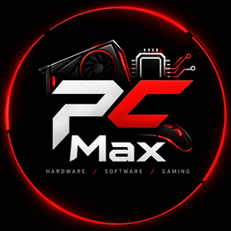
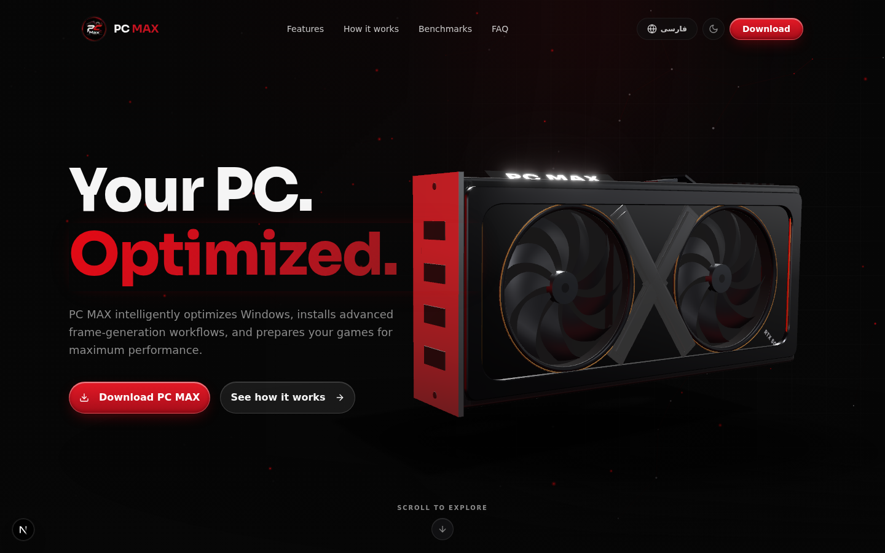
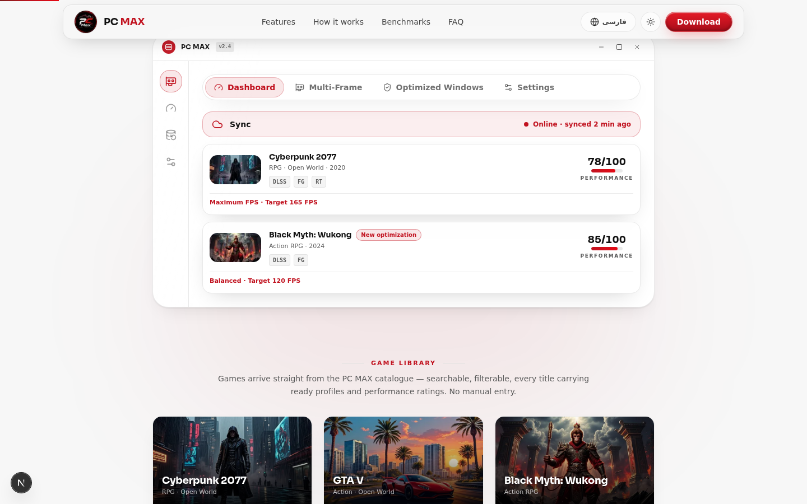
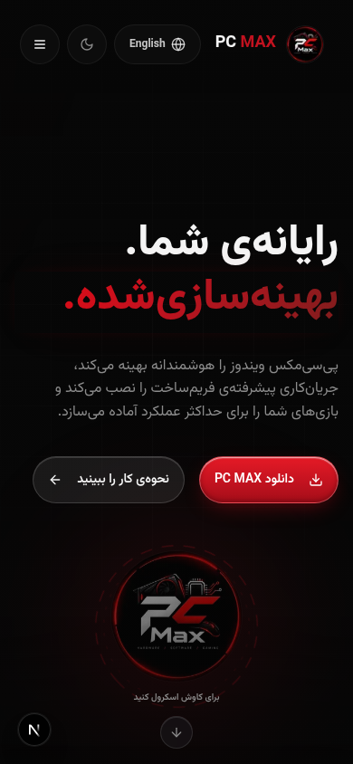

<div align="center">



# PC MAX — Official Website

**Marketing & download site for [PC MAX](https://github.com/CiaNetIR/pc-max) — the Windows game-optimization platform.**

[](https://cianetir.github.io/pc-max-web/)
[](https://github.com/CiaNetIR/pc-max)
[](CHANGELOG.md)

[](https://nextjs.org/)
[](https://react.dev/)
[](https://www.typescriptlang.org/)
[](https://tailwindcss.com/)
[](https://www.prisma.io/)
[](https://r3f.dev/)
[](#-فارسی)

**English** · [فارسی](#-فارسی)

</div>

---

<p align="center">
  
</p>

<p align="center">
  
  
</p>

## ✨ Highlights

- **Product-accurate bilingual landing (EN/FA)** — every fact on this site (install steps, Smart Profiles, transactional rollback, the 235 CI tests) is synchronized with the real [desktop application](https://github.com/CiaNetIR/pc-max), with full RTL and bidi-safe typography.
- **Real-time 3D GPU hero** — a React-Three-Fiber graphics card with inertia/damping physics, contact shadows, theme-aware lighting, and a "PC MAX" LED backplate. Runs on a demand-driven render loop (`frameloop="never"` + one manual rAF) and **self-heals after WebGL context loss**.
- **Mobile never ships the 3D** — dynamic import + `ssr:false` + a ≥1024px guard mean phones download zero WebGL code and get the full content instantly.
- **Interactive product dashboard** — Home / Multi-Frame / Optimized Windows / Settings tabs that mirror the actual app, including the Windows tuning surface (Registry · Services · Scheduled tasks · Game files) with snapshot/rollback rows.
- **Live release pipeline** — the download buttons resolve the newest real release of the [app repository](https://github.com/CiaNetIR/pc-max) live from GitHub Releases (REST resolver + hand-verified baseline + honest `releases/latest` fallback); legacy `/api/download` hits permanently redirect there.
- **Dark & light themes**, calibrated motion (every animation neutralized under `prefers-reduced-motion`), and an a11y-hardened shell (focus traps, aria pairing, 44px touch targets, isolated digits in RTL).
- **SEO-complete** — SSR-everything, JSON-LD, OpenGraph, sitemap/robots/manifest, and `llms.txt` / `llms-full.txt` for LLM crawlers.

## 🧱 Tech Stack

| Layer         | Choice                                                        |
| ------------- | ------------------------------------------------------------- |
| Framework     | [Next.js 16](https://nextjs.org/) (App Router) + React 19     |
| Language      | TypeScript 5 (strict)                                         |
| Styling       | Tailwind CSS 4 · shadcn/ui (New York) · Lucide icons          |
| 3D            | React Three Fiber · drei · three.js 0.186 · postprocessing    |
| Motion        | Framer Motion 12 (reduced-motion aware)                       |
| Data          | Prisma ORM + SQLite (`Release`, `ChangelogEntry`, `WaitlistSubscriber`, `EventLog`) |
| Theming       | next-themes (class strategy, dark default)                    |
| i18n          | Custom dictionary provider — EN/FA with cookie + `?lang=fa`   |
| Runtime       | Bun (dev + scripts)                                           |

## 🚀 Getting Started

```bash
bun install          # dependencies
bun run db:push      # create the SQLite schema (db/custom.db)
bun prisma/seed.ts   # seed releases + changelog history
bun run dev          # http://localhost:3000
```

> `/api/download` redirects to the app repository's GitHub Releases — no local artifact needed.

## 📜 Scripts

| Command               | Purpose                                             |
| --------------------- | --------------------------------------------------- |
| `bun run dev`         | Dev server on port 3000                             |
| `bun run lint`        | ESLint (Next.js + React rules)                      |
| `bun run build`       | Production build (standalone output)                |
| `bun run start`       | Serve the standalone production build               |
| `bun run db:push`     | Push `prisma/schema.prisma` to SQLite               |
| `bun prisma/seed.ts`  | Wipe + re-seed release & changelog data             |

## 🗂 Project Structure

```
├─ public/                     # static assets
│  ├─ brand/ · games/          #   brand icons, game cover art (WebP)
│  ├─ fonts/                   #   self-hosted woff2 faces
│  └─ llms.txt · llms-full.txt #   machine-readable site facts
├─ prisma/
│  ├─ schema.prisma            # Release · ChangelogEntry · WaitlistSubscriber · EventLog
│  └─ seed.ts                  # release + changelog history
├─ src/
│  ├─ app/
│  │  ├─ api/                  # release · download · changelog · stats · waitlist · analytics
│  │  ├─ layout.tsx            # fonts, theme provider, SEO metadata, JSON-LD
│  │  ├─ page.tsx              # the landing page — every section, server-rendered
│  │  ├─ globals.css           # Tailwind 4 theme tokens (light/dark) + keyframes
│  │  └─ robots.ts · sitemap.ts · manifest.ts
│  ├─ components/pcmax/
│  │  ├─ hero/                 # 3D GPU scene, constellation canvas, layered composition
│  │  ├─ sections/             # what-is → install-flow → features → multi-frame →
│  │  │                        # profiles → system-safety → benchmarks → social-proof →
│  │  │                        # faq → download-cta · app-showcase · mobile-cta-bar
│  │  ├─ i18n/dictionary.ts    # single source of every EN/FA string
│  │  └─ navbar · footer · language-context · ui/
│  └─ lib/                     # Prisma singleton, SEO helpers
└─ docs/screenshots/           # imagery used in this README
```

## 🔌 API Endpoints

| Route             | Method    | Behavior                                                                  |
| ----------------- | --------- | ------------------------------------------------------------------------- |
| `/api`            | GET       | Public service info + endpoint index (no stack details leaked)             |
| `/api/release`    | GET       | Latest stable release: version, notes, file name                           |
| `/api/download`   | GET / HEAD| Streams the real installer + `x-sha256` header; **GET counts, HEAD doesn't** |
| `/api/changelog`  | GET       | Versioned changelog entries                                                |
| `/api/stats`      | GET       | Aggregate downloads / waitlist / releases for the live badge (short cache)  |
| `/api/waitlist`   | POST      | Email subscribe — validated, deduped, rate-limited                         |
| `/api/analytics`  | POST      | Lightweight event beacon (`pageview` / `section_view` / `download`)        |

All routes are hardened: method guards (405), payload caps (413), per-IP rate limits (429), path-traversal protection, and cache headers.

## 🏗 Architecture Notes

- **Demand-driven 3D.** The hero Canvas uses `frameloop="never"` and one manual rAF loop calling `advance(t)` — the GPU renders only while the hero is on screen. A virtual seconds-clock + Δt clamping keeps motion frame-rate independent; on WebGL context loss the loop rebuilds with clock realignment, camera re-pump, and texture/font guards.
- **Layered hero composition.** background → constellation → atmosphere → scrim → GPU → content — the 3D never veils typography, and a protected quiet zone keeps constellation lines away from the headline.
- **One content source.** `src/components/pcmax/i18n/dictionary.ts` holds every string in both languages; the provider flips `<html dir>` and isolates digits/identifiers so Persian text stays correct in RTL.
- **SSR-everything.** All sections render server-side for SEO and no-JS users; hydration cost is deferred with `LazySection`, and `animated-counter` SSRs its final value.
- **Motion discipline.** Springs and durations are calibrated per interaction (press, tabs, reveals) and every one of them collapses to a static state under `prefers-reduced-motion`.

## 🌍 Internationalization

English and Persian (فارسی) ship as first-class citizens:

- Switch via the navbar toggle, the `NEXT_LOCALE` cookie, or `?lang=fa`
- Full `dir="rtl"` flip, Persian typography (Vazirmatn / Ariobarzan / Estedad), bidi-isolated numerals
- Language-correct metadata, OG tags, and JSON-LD

## 🏷 Versioning & Releases

This repository follows [Semantic Versioning](https://semver.org/). Every version is:

1. documented in [`CHANGELOG.md`](CHANGELOG.md),
2. tagged as an annotated git tag (`vX.Y.Z`), and
3. published as a **GitHub Release** with full notes.

```bash
./scripts/release.sh 1.1.0 "Multi-Frame polish + light-mode shadows"
```

The helper bumps `package.json`, commits, tags, pushes, opens the GitHub Release, and attaches the installer artifact (`public/releases/*.exe`) to it.

---

## 🌐 Deployment — two flavors, one codebase

| | SSR flavor (default) | Static flavor (GitHub Pages) |
| --- | --- | --- |
| Output | `output: "standalone"` (`bun run build`) | `output: "export"` + `basePath: "/pc-max-web"` |
| Lives at | your server / the live preview | **https://cianetir.github.io/pc-max-web/** |
| `/api/*` routes, waitlist, analytics | ✅ | stripped from the build tree (`src/app/api` + `src/proxy.ts`) |
| Download button | `/api/download` — streams + counts | links directly to the deployed installer artifact |
| Release / changelog / stats | Prisma per request | baked at build time from a deterministically re-seeded SQLite |
| SEO base URLs | `pcmax.app` (canonical brand) | the Pages origin (self-canonical mirror) |
| Persian (`?lang=fa`) | server-rendered via proxy | EN prerender; the visitor's locale is restored client-side right after hydration |

Build & publish the static mirror manually:

```bash
bash scripts/gh-pages-build.sh        # isolated copy of the project → ./out
```

CI ([`.github/workflows/deploy-pages.yml`](.github/workflows/deploy-pages.yml)) rebuilds and republishes the `gh-pages` branch on **every push to `main`** — the live site stays current automatically.

## 🇮🇷 فارسی

**پی‌سی‌مکس وب** — وب‌سایت رسمی محصول [پی‌سی‌مکس](https://github.com/CiaNetIR/pc-max)، پلتفرم بهینه‌سازی بازی روی ویندوز.

- **دوزبانه و راست‌به‌چپ** — انگلیسی و فارسی با تایپوگرافی فارسی (وزیرمتن، آریوبرزن، استعداد) و جداسازی درست اعداد در متن RTL
- **نسخهٔ زنده روی GitHub Pages** — [cianetir.github.io/pc-max-web](https://cianetir.github.io/pc-max-web/)؛ با هر push به شاخهٔ main به‌صورت خودکار بازسازی و منتشر می‌شود
- **هیروی سه‌بعدی GPU** — فقط برای دسکتاپ؛ موبایل بدون هیچ کد WebGL محتوا را فوراً نمایش می‌دهد
- **داشبورد محصول** — تب‌های خانه / مولتی‌فریم / ویندوز بهینه‌شده / تنظیمات، مطابق اپ واقعی
- **دانلود واقعی** — دکمهٔ دانلود، نصب‌کنندهٔ واقعی را با هش SHA-256 سرو می‌کند و شمارنده را به‌صورت اتمیک افزایش می‌دهد
- **دارک/لایت، سئو کامل، دسترس‌پذیری بالا** و احترام به `prefers-reduced-motion`

### اجرا

```bash
bun install && bun run db:push && bun prisma/seed.ts && bun run dev
```

تغییرات هر نسخه در [`CHANGELOG.md`](CHANGELOG.md) و به‌صورت GitHub Release منتشر می‌شود.

---

<div align="center">

**PC MAX Web** · official site of [PC MAX](https://github.com/CiaNetIR/pc-max) · maintained by [CiaNetIR](https://github.com/CiaNetIR)

</div>
